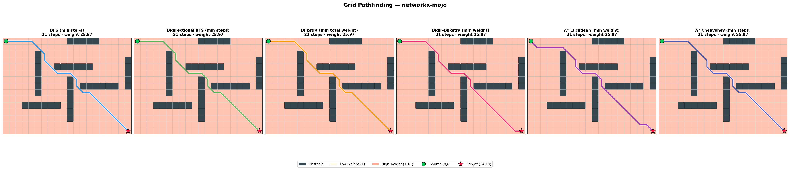

# networkx-mojo

Mojo implementation of a subset of the Python NetworkX API.

## Requirements

- Mojo (installed into a local `.venv` via `uv`)

## Install Mojo (via uv)

Follow the official install docs for your platform.

Nightly (recommended for development):

```bash
uv venv
. .venv/bin/activate
uv pip install mojo --index https://whl.modular.com/nightly/simple/ --prerelease allow
```

Stable:

```bash
uv venv
. .venv/bin/activate
uv pip install mojo --extra-index-url https://modular.gateway.scarf.sh/simple/
```

## Run tests

```bash
.venv/bin/mojo run -I . tests/test_graph.mojo
.venv/bin/mojo run -I . tests/test_digraph.mojo
.venv/bin/mojo run -I . tests/test_algorithms.mojo
.venv/bin/mojo run -I . tests/test_attrs.mojo
.venv/bin/mojo run -I . tests/test_more_algorithms.mojo
```

## Benchmarks

```bash
.venv/bin/mojo run -I . benches/graph_bench.mojo
```

## Examples

Grid pathfinding + visualization:



```bash
.venv/bin/mojo run -I . examples/grid_pathfinding.mojo
```

If you're using `uv run`, make sure you invoke `mojo run` with `-I .` so Mojo can
resolve local modules (like `networkx`):

```bash
uv run mojo run -I . examples/grid_pathfinding.mojo
```

The visualization script requires the optional dependencies:

```bash
uv pip install -e '.[bench]'
```
